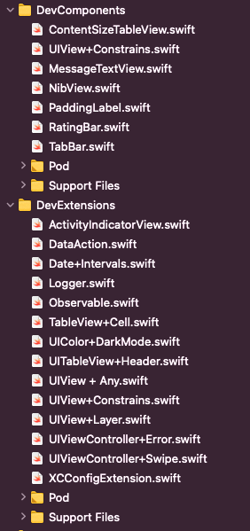
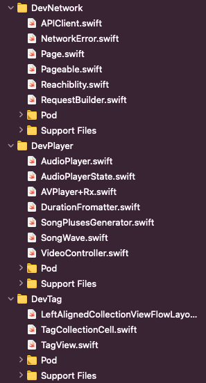

# EveryDayCodeBlocks

Dont repeat your self every day.
Feel free to copy pase what you need, If you need too much you could use it as a pod.

  

 

EveryDayCodeBlocks is a collection of **over 20 native Swift extensions and component**, with handy methods, syntactic sugar, and performance improvements for wide range of primitive data types, UIKit and Cocoa classes –over 20 in 1– for iOS

## Requirements

- **iOS** 10.0+ 
- Swift 5.0+

## Installation

CocoaPods

 

To integrate EveryDayCodeBlocks into your Xcode project using <a href="http://cocoapods.org">CocoaPods</a>, specify it in your <code>Podfile</code>:

<h4>- Integrate All extensions and components (recommended):</h4>
<pre><code class="ruby language-ruby">pod 'DevPods', :git=>URL</code></pre>

<h4>- Integrate Network Module only:</h4>
<pre><code class="ruby language-ruby">pod 'DevPods/DevNetwork', :git=>URL</code></pre>

<h4>- Integrate UIComponents only:</h4>
<pre><code class="ruby language-ruby">pod 'DevPods/UIComponents', :git=>URL</code></pre>

Swift Package Manager

 

You can use <a href="https://swift.org/package-manager">The Swift Package Manager</a> to install <code>EveryDayCodeBlocks</code> by adding the proper description to your <code>Package.swift</code> file:

<pre><code class="swift language-swift">import PackageDescription

let package = Package(
    name: "YOUR_PROJECT_NAME",
    targets: [],
    dependencies: [
        .package(url: "https://github.com/abuzeid-ibrahim/DevPods", from: "0.0.1")
    ]
)
</code></pre>

Next, add <code>EveryDayCodeBlocks</code> to your targets dependencies like so:

<pre><code class="swift language-swift">.target(
    name: "YOUR_TARGET_NAME",
    dependencies: [
        "DevPods",
    ]
),</code></pre>

Then run <code>swift package update</code>.

Note that the <a href="https://swift.org/package-manager">Swift Package Manager</a> doesn't support building for iOS/tvOS/macOS/watchOS apps

Manually

 

Add the <a href="https://github.com/abuzeid-ibrahim/DevPods">EveryDayCodeBlocks</a> folder to your Xcode project to use all extensions, or a specific extension.

Goya Buzz is a twitter anylatics tool **Swift**/**Moduler**/**Test**/**MVVM**.

| Files                      | _                          | _                         |
| -------------------------- | -------------------------- | -------------------------- |
|   |    | _                          |

## List of All Components

 Components and Extensions

 
<ul>
<li><a href="https://github.com/abuzeid-ibrahim/DevPods/tree/master/DevExtensions"><code>Dev Extensions</code></a></li>
<li><a href="https://github.com/abuzeid-ibrahim/DevPods/tree/master/DevNetwork"><code>Dev Network</code></a></li>
<li><a href="https://github.com/abuzeid-ibrahim/DevPods/tree/master/UIComponents"><code>Dev Component</code></a></li>
<li><a href="https://github.com/abuzeid-ibrahim/DevPods/tree/master/UIComponents"><code>Dev Player</code></a></li>
 <li><a href="https://github.com/abuzeid-ibrahim/DevPods/tree/master/UIComponents"><code>Dev Tag</code></a></li>
</ul>

## How cool is this?

EveryDayCodeBlocks is a library of **over 200 properties and methods**, designed to extend Swift's functionality and productivity, staying faithful to the original Swift API design guidelines.

Check Examples.playground from the project for some cool examples!

## Get involved
More is coming soon...
We want your feedback.
Please refer to [contributing guidelines](https://github.com/EveryDayCodeBlocks/EveryDayCodeBlocks/tree/master/CONTRIBUTING.md) before participating.

